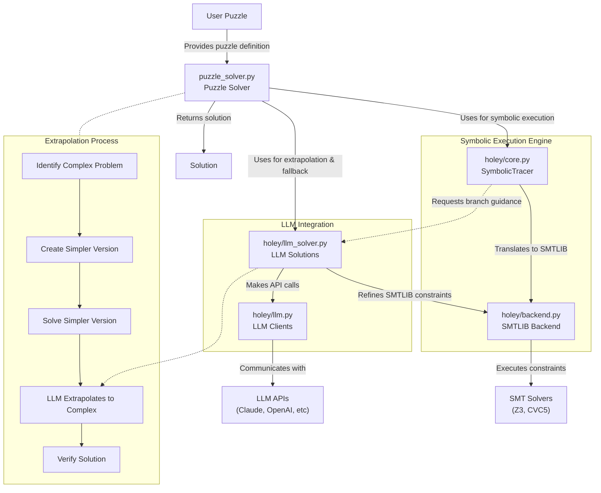

# Holey Diagram

```mermaid
graph TD
    %% Core Components
    Core["holey/core.py<br>SymbolicTracer"]
    Backend["holey/backend.py<br>SMTLIB Backend"]
    PuzzleSolver["puzzle_solver.py<br>Puzzle Solver"]
    LLM["holey/llm.py<br>LLM Clients"]
    LLMSolver["holey/llm_solver.py<br>LLM Solutions"]
    
    %% External Components
    LLMProviders["LLM APIs<br>(Claude, OpenAI, etc)"]
    SMTSolvers["SMT Solvers<br>(Z3, CVC5)"]
    
    %% Main Dependencies with labels
    PuzzleSolver -->|"Uses for symbolic execution"| Core
    PuzzleSolver -->|"Uses for extrapolation & fallback"| LLMSolver
    Core -->|"Translates to SMTLIB"| Backend
    Backend -->|"Executes constraints"| SMTSolvers
    LLMSolver -->|"Makes API calls"| LLM
    LLMSolver -->|"Refines SMTLIB constraints"| Backend
    LLM -->|"Communicates with"| LLMProviders
    Core -.->|"Requests branch guidance"| LLMSolver
    
    %% Input/Output
    UserPuzzle["User Puzzle"] -->|"Provides puzzle definition"| PuzzleSolver
    PuzzleSolver -->|"Returns solution"| Solution["Solution"]

    %% Extrapolation Process Highlight
    subgraph ExtrapolationProcess["Extrapolation Process"]
        Step1["Identify Complex Problem"]
        Step2["Create Simpler Version"]
        Step3["Solve Simpler Version"]
        Step4["LLM Extrapolates to Complex"]
        Step5["Verify Solution"]
        
        Step1 --> Step2 --> Step3 --> Step4 --> Step5
    end
    
    %% Connect to main flow
    PuzzleSolver -.- ExtrapolationProcess
    LLMSolver -.-> Step4
    
    %% Component Grouping
    subgraph SymbolicExecution["Symbolic Execution Engine"]
        Core
        Backend
    end
    
    subgraph LLMIntegration["LLM Integration"]
        LLM
        LLMSolver
    end
```
