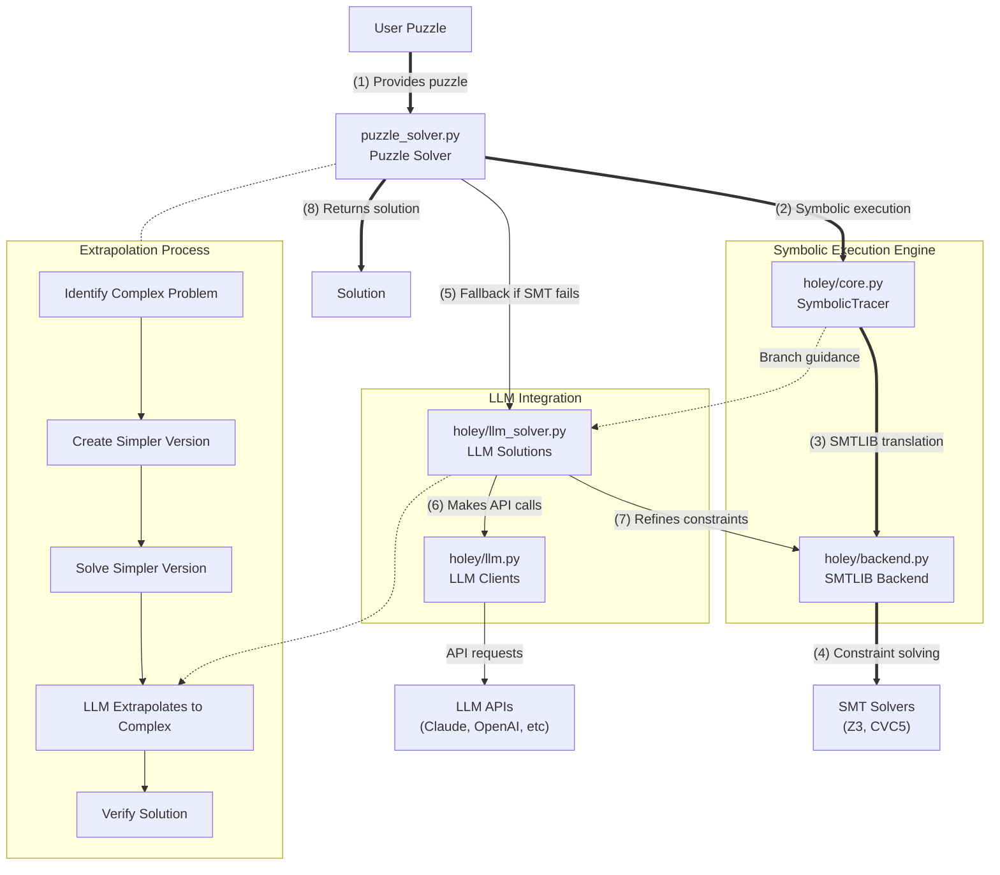

# Holey Diagram

```mermaid
graph TD
    %% Core Components
    Core["holey/core.py<br>SymbolicTracer"]
    Backend["holey/backend.py<br>SMTLIB Backend"]
    PuzzleSolver["puzzle_solver.py<br>Puzzle Solver"]
    LLM["holey/llm.py<br>LLM Clients"]
    LLMSolver["holey/llm_solver.py<br>LLM Solutions"]
    
    %% External Components
    LLMProviders["LLM APIs<br>(Claude, OpenAI, etc)"]
    SMTSolvers["SMT Solvers<br>(Z3, CVC5)"]
    
    %% Main Execution Path (thicker lines)
    UserPuzzle["User Puzzle"] ==>|"(1) Provides puzzle"| PuzzleSolver
    PuzzleSolver ==>|"(2) Symbolic execution"| Core
    Core ==>|"(3) SMTLIB translation"| Backend
    Backend ==>|"(4) Constraint solving"| SMTSolvers
    PuzzleSolver ==>|"(8) Returns solution"| Solution["Solution"]
    
    %% Alternative/Fallback Paths
    PuzzleSolver -->|"(5) Fallback if SMT fails"| LLMSolver
    LLMSolver -->|"(6) Makes API calls"| LLM
    LLMSolver -->|"(7) Refines constraints"| Backend
    LLM -->|"API requests"| LLMProviders
    Core -.->|"Branch guidance"| LLMSolver
    
    %% Extrapolation Process Highlight
    subgraph ExtrapolationProcess["Extrapolation Process"]
        Step1["Identify Complex Problem"]
        Step2["Create Simpler Version"]
        Step3["Solve Simpler Version"]
        Step4["LLM Extrapolates to Complex"]
        Step5["Verify Solution"]
        
        Step1 --> Step2 --> Step3 --> Step4 --> Step5
    end
    
    %% Connect to main flow
    PuzzleSolver -.- ExtrapolationProcess
    LLMSolver -.-> Step4
    
    %% Component Grouping
    subgraph SymbolicExecution["Symbolic Execution Engine"]
        Core
        Backend
    end
    
    subgraph LLMIntegration["LLM Integration"]
        LLM
        LLMSolver
    end
```
