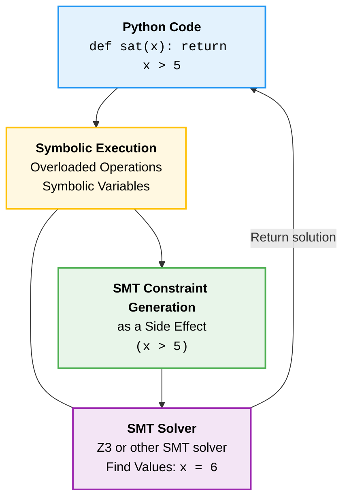

# Holey: Multi-stage programming SMT: Overloaded execution generates constraints

```mermaid
flowchart TB
    PythonCode["<b>Python Code</b><br><tt>def sat(x): return x > 5</tt>"] --> SymbolicExecution
    
    SymbolicExecution["<b>Symbolic Execution</b><br>Overloaded Operations<br>Symbolic Variables"] --> SMTGeneration
    SymbolicExecution --- SMTSolver
    
    SMTGeneration["<b>SMT Constraint Generation</b><br>as a Side Effect<br><tt>(x > 5)</tt>"] --> SMTSolver
    
    SMTSolver["<b>SMT Solver</b><br>Z3 or other SMT solver<br>Find Values: <tt>x = 6</tt>"] --> |Return solution| PythonCode

    classDef python fill:#e3f2fd,stroke:#2196f3,stroke-width:2px,color:black;
    classDef execution fill:#fff8e1,stroke:#ffc107,stroke-width:2px,color:black;
    classDef generation fill:#e8f5e9,stroke:#4caf50,stroke-width:2px,color:black;
    classDef solver fill:#f3e5f5,stroke:#9c27b0,stroke-width:2px,color:black;
    
    class PythonCode python;
    class SymbolicExecution execution;
    class SMTGeneration generation;
    class SMTSolver solver;
```
